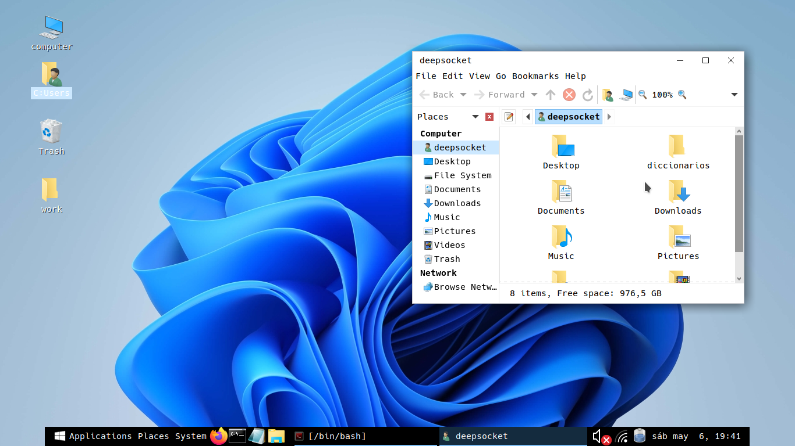

<h1>Camufla tu linux de windows 11 con WINUX</h1>

Winux es una herramienta programa en C, diseñada para poder 
camuflar tu linux con escritorio MATE a un diseño parecido al 
de windows11. 

 

 

COMANDOS 
sudo bash install.sh 

